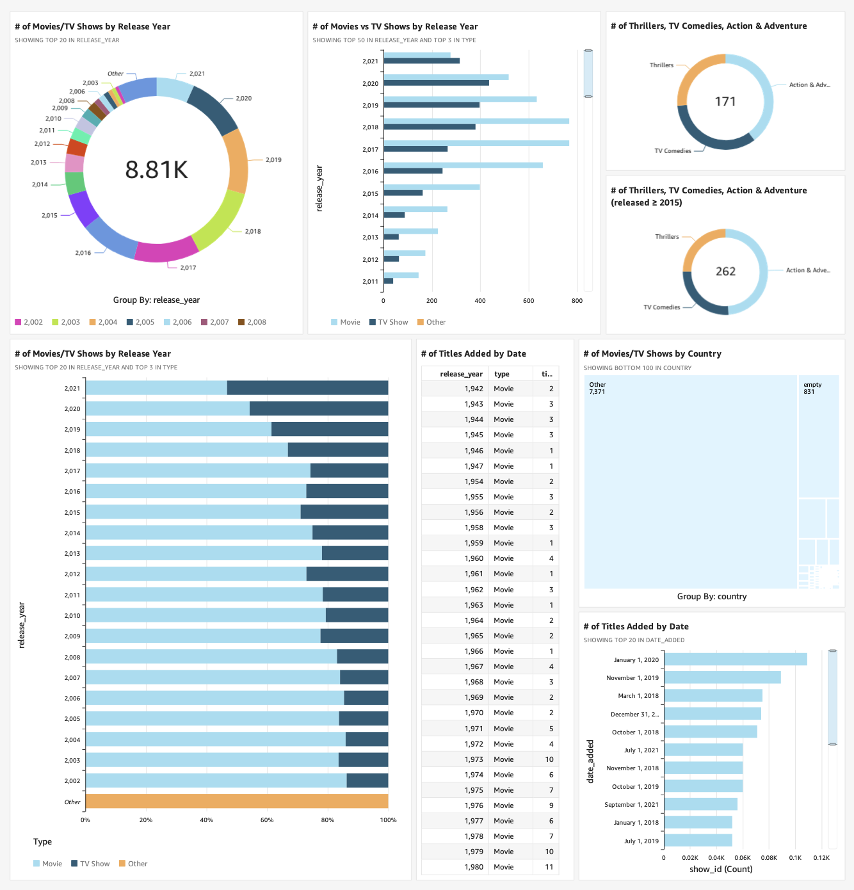

# Netflix QuickSight with AWS CDK  



--- 

## 📖 Project Overview  
This project demonstrates how to integrate **Amazon QuickSight** with an **S3 bucket** using **AWS CDK**.  
I used CDK to provision an S3 bucket, upload the dataset and manifest, and connect it to QuickSight through L1 constructs (`CfnDataSource`, `CfnDataSet`).  

The dataset used is `netflix_titles.csv`, a Netflix catalog dataset. A `manifest.json` file is included to define global settings for QuickSight ingestion.  

## ⚙️ Services & Tools Used  
- **AWS CDK** – Infrastructure as Code (IaC)  
- **Amazon S3** – Storage for dataset (`netflix_titles.csv`) and `manifest.json`  
- **Amazon QuickSight** – Data visualization and dashboards  


## 🛠️ Project Structure  
```
netflix-quicksight/
├── lib/
│   ├── constructs/
│   │   ├── storage/aws-s3-deploy.ts       # S3 bucket + deployment construct
│   │   └── visualization/aws-s3-quicksight.ts  # QuickSight L1 constructs
│   └── stacks/netflix-quicksight-stack.ts # CDK Stack entry
├── data/netflix-dataset/
│   ├── manifest.json
│   └── netflix_titles.csv
├── test/
├── cdk.json
├── package.json
└── tsconfig.json
```


## 🚀 Steps I Took  

### 1. Upload dataset to S3  
- Stored **`manifest.json`** and **`netflix_titles.csv`** in an S3 bucket.  
- Edited `manifest.json` to point to the correct S3 bucket (unique name).  

### 2. Create QuickSight account  
- Signed up for the free trial of QuickSight.  
- Linked QuickSight to AWS CDK by configuring permissions and roles.  

### 3. Connect S3 to QuickSight  
- Used `CfnDataSource` and `CfnDataSet` to connect S3 to QuickSight.  
- `manifest.json` was required to point to the dataset.  
- Also added **`uploadSettings`** in `CfnDataSet` (CSV format, delimiter, header config) to ensure proper parsing.  

### 4. Build Visualizations  
- First visualization: **Movies vs TV Shows by Release Year** (stacked bar chart).  
- Added filters for genres (Thrillers, TV Comedies, Action & Adventure) → donut chart.  
- Built a **dashboard** by combining visuals.  

### 5. Export Dashboard  
- Organized panels in a clean layout.  
- Exported dashboard as **PDF** for sharing.  


## 💡 Key Learnings  
- **Manifest.json** guides QuickSight to the dataset in S3.  
- **CfnDataSet uploadSettings** are still required to define CSV format and structure.  
- IAM permissions are crucial — QuickSight needs explicit access to the S3 bucket.  


## ⏱️ Reflection  
- **Duration:** ~16 hours  
- **Most challenging part:** Configuring permissions for QuickSight.  
- **Most rewarding part:** Successfully integrating the dataset from S3 into QuickSight via CDK.  
